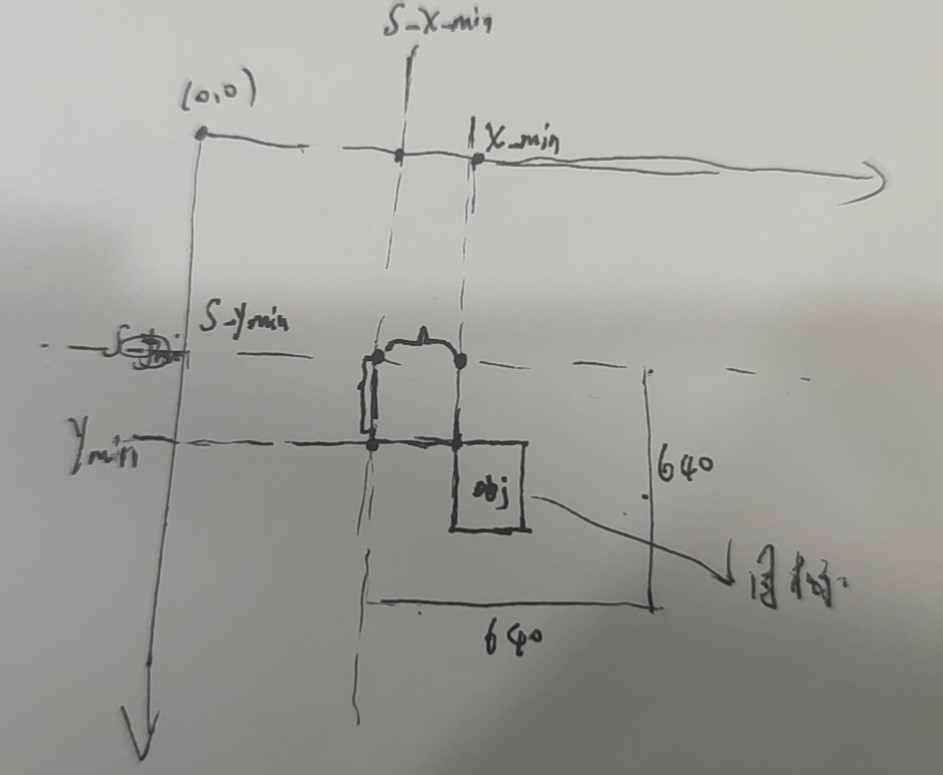
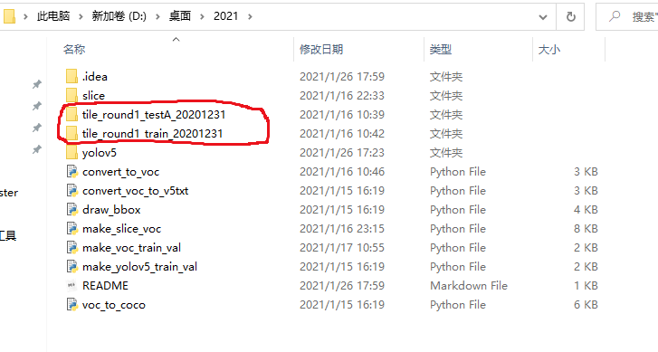

**切图思路：**

- 待切的原图大小为:h=6000,w=8192。
- overlop比例:0.2，切图尺寸:640x640。

- 则步长为512。

- 从原图左上角开始切图,切出来图像的左上角记为x,y。
- 那么可以容易想到y依次为:0,512,1024,....,5120。但接下来却并非是5632,因为5632+640>6000,所以这里要对切图的overlop做一个调整,最后一步的y=6000-640。

**标签的变化：**

根据上面的切图思路,目标的标签:x_min,y_min,x_max,y_max要分配给每一个被切出来的小图(640x640)，剩下的图当做背景过滤掉。

假设:

- 当前"小图"的左上角坐标在原图中的位置为:s_x_min,s_y_min.

- 原图上面有一个框的坐标为:x_min,y_min,x_max,y_max.

- 如果该框在该"小图"内部(这个根据坐标很好判断),

  - 则该框相对于该"小图"的新坐标:x_min-s_x_min,y_min-s_y_min

    

**环境：**torch>1.4

**预训练模型：**去年六七月份的，并不是最新的代码和权重。

最新的代码和权重链接：https://github.com/ultralytics/yolov5/tree/master/weights

**代码运行说明：**

数据集下载到当前目录下（**数据集在服务器上的位置为`/data1/zzy/`，切好的图片位置为`/data1/zzy/tianchi/slice`**）



python

```bash
python convert_to_voc.py #先将原始数据转为VOC格式的标注
python make_slice_voc.py #将上述图片切为小图，重新制作为voc.
python convert_voc_to_v5txt.py #将voc标注转换为yolov5的官方格式.
python make_yolov5_train_val.py #制作yolov5的train/val.
cd ./yolov5
python train.py                 #训练
```
- yolov5/train.py #训练参数设置
- yolov5/infer_tile.py #单图大尺度预测
- yolov5/infer_slice_tile.py #切图滑窗预测


